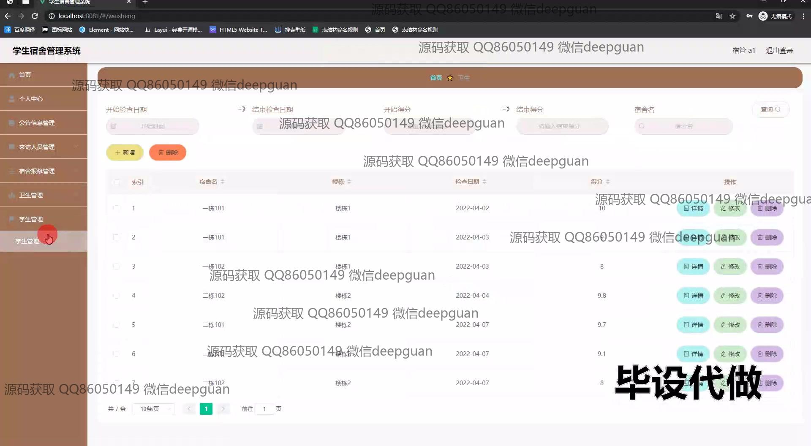

<h1 align="center">高校宿舍管理系统+vue</h1>

## 简介
高校宿舍管理系统：角色分为管理员、宿管、学生；支持宿舍信息管理、卫生管理、报修管理、公告管理、来访人员管理、学生管理等功能，操作简洁高效。    --计算机毕业设计源码；毕设源码；java毕业设计源码

## 联系方式

<h3 align="center">获取完整代码与数据库文件 + 微信：deepguan QQ: 86050149 QQ群: 783742310</h3>

<h3 align="center">可帮忙远程部署 包运行成功！提供远程部署、修改代码、设计文档指导、代码讲解等服务！</h3>

## 功能介绍（完整见运行截图）
管理员：主要负责系统的整体管理，包括班主任、宿舍楼、宿舍卫生、公告信息、以及报修信息的管理。管理员可以进行用户角色管理，通过导航菜单访问不同模块，查看和编辑公告类型、楼栋信息和宿舍检查记录等。此外，管理员可以通过筛选功能对宿舍卫生评分进行查询和管理，并可以查看详细信息和修改记录。

班主任：能够管理班级信息和学生宿舍的卫生评分，班主任可以通过功能菜单访问相应模块，对学生信息进行查看、修改和删除操作。他们也可以查看和管理宿舍卫生检查记录，核对评分信息，并按条件进行查询和管理。

宿管：负责宿舍日常管理，包括宿舍入住信息、物品报修、以及卫生管理。宿管可以添加、编辑和删除宿舍信息，处理学生的报修请求，并管理宿舍卫生检查和评分记录，通过系统界面进行查看、记录和更新相关信息。

学生：可以在系统中查看自己所在宿舍的信息和公告，并提交报修信息。学生通过个人中心访问和更新个人信息，查看宿舍公告和卫生评分结果。他们还可以使用宿舍报修功能，输入物品和描述进行报修申请，并查看报修状态。

## 运行截图

本代码来源于网络,仅供学习参考使用!

